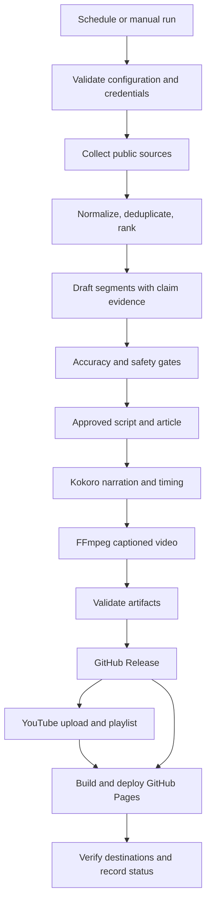

# Software Requirements Specification (SRS)
## IS Security Update — Database Security & Data Protection Podcast

| Field | Value |
|---|---|
| Version / status | 1.0 / Draft for review |
| Date | 2026-09-12 |
| Requirements baseline | [BRD.md](BRD.md), Draft v0.2, dated 2026-09-12 |
| Business author | Shahbaz |
| System owner / operator | Receiving friend; identity to be confirmed |
| Implementation plan | [ACTION_PLAN.md](ACTION_PLAN.md) |

## 1. Purpose and interpretation

This specification translates the BRD into implementable, verifiable requirements for an unattended daily security briefing. Outputs are narrated audio, a captioned video, a cited transcript, and a standalone article, published through the operator's own GitHub repository, GitHub Pages site, and YouTube channel.

“Shall” denotes a required behavior. BRD requirements remain the business baseline. Details labelled **proposed** are engineering recommendations requiring review before they become the agreed baseline. Open decisions do not prevent implementation of independent modules, but must be resolved before the dependent production capability is enabled. This document does not imply that software, accounts, source feeds, or deployments already exist.

## 2. Scope, users, and boundaries

V1 covers public-source collection, relevance filtering, deduplication, evidence-backed scripting, automated safety checks, single-voice English TTS, captioned video, three publishing destinations, and operational reporting. Primary topics are CipherTrust Manager, Imperva DAM, and general database security. Adjacent Thales data-protection updates receive lighter coverage. Include one relevant real incident when available in the lookback window.

The operator manages accounts, configuration, credentials, failures, and publishing decisions. Readers/listeners consume the static website, YouTube, or release files without a new application account. The implementer builds and hands over the independent repository and runbook.

Daily execution shall run in GitHub Actions without the operator's PC. The PC is needed only for setup, local testing, and interactive OAuth authorization. Reuse of `shahbaz-daily-updates` is limited to permitted source-code/design reuse. Its source code was not present in this workspace and has not been inspected; reuse feasibility and licensing remain dependencies.

Permanent exclusions: private/client/engagement data, working exploit code, payloads, and attack instructions. V1 exclusions: mobile app, Firebase/push notifications, multilingual narration, and multi-voice dialogue. No RSS podcast-distribution feed is specified by the BRD; audio hosting alone is in scope.

## 3. Architecture and execution model

Persist a run manifest across runner restarts. Publishing shall support partial completion: the Pages article may use the release video while YouTube is unavailable, and shall be updated when YouTube succeeds. A partial run shall never be reported as full publication success.

Proposed module boundaries: `collect/`, `processing/`, `script/`, `safety/`, `audio/`, `video/`, `publish/`, `auth/`, and a shared configuration/logging layer under `pipeline/`. Dependencies shall flow through versioned intermediate records rather than implicit global files.

## 4. Functional requirements and acceptance criteria

All requirements below are V1 requirements unless explicitly labelled proposed. Acceptance scenarios are elaborated in Section 10.

### 4.1 Configuration and collection

| ID | Requirement | Acceptance criterion | BRD reference |
|---|---|---|---|
| SRS-F01 | The system shall load topics, enabled sources, product aliases, and ranking settings from validated configuration. | A topic/source supported by an existing adapter is added or disabled without changing application code; invalid configuration fails before collection. A new transport may require an adapter. | §7, §9 |
| SRS-F02 | The system shall collect items within a fixed trailing 24-hour window. Proposed boundary: `[window_end - 24h, window_end)`, with `window_end` tied to the scheduled edition and stored in UTC. | Start-boundary items are included; end-boundary items are excluded; reruns use the same stored window. | FR-1 |
| SRS-F03 | Each collected item shall retain source URL, title, source identity, publication/update timestamp and its provenance, retrieval time, and topic/product classification. | Every accepted item has required metadata; missing or ambiguous timestamps are quarantined, not treated as newly published. A documented material update may qualify using its update time. | FR-1, FR-11 |
| SRS-F04 | Collection shall use public, permitted sources, preferring official APIs/RSS before permitted HTML extraction. | Each enabled source has a verified public endpoint, access-method record, policy review date, and fixture. Authentication-only support content and private submissions are excluded. | §4, §9, §10 |
| SRS-F05 | The collector shall isolate individual source failures and expose coverage gaps. | One unavailable source does not erase other results; all-source failure stops generation and is not labelled a quiet news day. | FR-14, §9 |

### 4.2 Selection and editorial processing

| ID | Requirement | Acceptance criterion | BRD reference |
|---|---|---|---|
| SRS-F06 | The system shall deduplicate overlapping reports and rank relevant items by product match, significance, recency, and source quality. | Duplicate reports yield one story with supporting links; unrelated security news is removed; official evidence is preferred for product/version claims. | FR-2, §7, §10 |
| SRS-F07 | The system shall generate one cohesive English script for each edition with meaningful approved news, using intro, relevant topic segments, optional incident segment, and outro. | Quiet topics are skipped or briefly noted; conversational wording preserves precise product names, versions, and CVE identifiers. | FR-3, FR-4, §11 |
| SRS-F08 | Release/advisory segments shall state verified changes and affected versions where available; version comparisons shall require evidence for both versions. | Unsupported comparisons are omitted or explicitly marked unavailable. No inferred patch, affected version, root cause, or resolution is asserted as fact. | FR-5, §3 |
| SRS-F09 | The system shall include one real, relevant incident segment when a sufficiently evidenced incident exists in the window. | Segment identifies what happened, known root cause, reported response, and practical takeaway; unavailable details are labelled unknown. General mitigation advice is distinguished from confirmed incident resolution. No qualifying incident means no segment. | FR-5, FR-12 |
| SRS-F10 | Every factual claim in transcript and article shall map to supporting source evidence. | Claims have source IDs/links and retained supporting excerpts or locators; exact CVE/version strings are checked against evidence. Unsupported claims are removed or regenerated and rechecked before publication. | FR-4, FR-11, §9 |
| SRS-F11 | The system shall target approximately 1,800–2,700 spoken words / 12–18 minutes on typical active days without padding. | A sparse-news fixture produces a shorter briefing with no invented or unrelated material. Record actual audio duration; 150 words/minute is an estimate, not forced playback speed. | FR-2, FR-6, §11 |
| SRS-F12 | All published text shall pass prompt-level restrictions and an automated segment-level content-safety gate. | A flagged segment receives at most one regeneration attempt; a second flag or unavailable checker withholds it. Article, captions, transcript, title, and description are also checked; raw unsafe drafts never become public assets. | FR-13, §9, §15.1 |
| SRS-F13 | Source content shall be treated as untrusted data, not instructions. | A source fixture containing instructions to reveal secrets or bypass gates cannot modify tools, prompts, configuration, or publish decisions; generated HTML is escaped/sanitized. | Derived from §4, §9 |

**Proposed no-news rule:** If collection succeeds but no eligible items exist, publish a short factual “no qualifying updates” edition and article with an explicit coverage note. If items exist but all are withheld by safety/accuracy gates, stop publication and notify the operator; do not label this “no news.” This resolves an ambiguity between daily delivery and no-padding objectives and requires decision D08.

### 4.3 Media and publication

| ID | Requirement | Acceptance criterion | BRD reference |
|---|---|---|---|
| SRS-F14 | The system shall generate single-narrator English audio from the approved script using the reused Kokoro approach. | Audio decodes, contains the full approved narration, and has no missing chunks; spoken CVE/version samples are intelligible. Proposed delivery format: MP3. | FR-6, §15 |
| SRS-F15 | The system shall render cover art and burned-in captions synchronized with actual narration timing. | Video decodes with an audio stream; captions match approved narration, are monotonic and bounded by duration. Proposed format: MP4/H.264/AAC, 1920×1080; proposed sampled sync tolerance: 0.5 seconds. | FR-7, §15 |
| SRS-F16 | The system shall publish audio, cited transcript, and captioned video to a dated GitHub Release. | All three files download and match recorded checksums. Proposed naming: `episode-YYYY-MM-DD` tag and `audio.mp3`, `transcript.md`, `video.mp4`; retries reuse the edition. | FR-8 |
| SRS-F17 | The system shall publish a standalone article at a stable per-date Pages URL, with embedded audio and video and citations. | `/episodes/YYYY-MM-DD/` resolves under the configured repository base path; release audio plays; YouTube or release video plays; article is readable independently of the transcript. | FR-9, FR-11, §12 |
| SRS-F18 | The Pages index/archive shall list all published article dates newest first, once each. | Publishing or retrying a new date preserves older links and does not duplicate an entry. | FR-9 |
| SRS-F19 | The system shall upload the approved video to the configured operator-owned YouTube channel and playlist with narration disclosure. | Uploaded video ID, channel, playlist membership, chosen visibility, title, description, and applicable disclosure settings are verified. Current platform requirements are checked before launch. | FR-10, §12, §13 |
| SRS-F20 | Publication shall be resumable and shall reconcile uncertain remote outcomes before retrying. | Failure after upload resumes using the existing video/release ID. An ambiguous YouTube upload is investigated/reconciled before another upload; playlist insertion and Pages deployment are independently retryable. | Derived from FR-8–10, §9 |
| SRS-F21 | Manual execution shall support edition/date, dry-run, and resume modes. | Dry-run generates local/staged artifacts without public writes; same-edition concurrent runs cannot publish duplicates; corrections require an explicit revision with a correction note. | Derived from §9, §13 |

### 4.4 Operations and ownership

| ID | Requirement | Acceptance criterion | BRD reference |
|---|---|---|---|
| SRS-F22 | Every stage shall emit structured status, timing, counts, and sanitized errors linked to a run ID. | An operator can identify the failed stage, affected sources or target, and next recovery action without credentials appearing in logs. | FR-14 |
| SRS-F23 | The system shall run daily against a configured timezone, ready-time, and execution buffer, with an operator-approved failure alert route. | Scheduler is translated to UTC; ready-time result is recorded; late, failed, and partial runs trigger actionable notification via the selected route. | §9, §17 |
| SRS-F24 | All runtime accounts, credentials, assets, and scheduled jobs shall belong to the receiving operator. | A run succeeds with the original author's PC off and without access to the original repository or credentials. | §13 |
| SRS-F25 | Retention shall be configurable and preserve archive integrity. | Proposed initial behavior is no automatic deletion; once policy is approved, cleanup identifies exact assets, updates affected pages, and never leaves silent broken links. | §9, §17 |

## 5. Data contracts and configuration

Proposed records (JSON or equivalent with schema validation):

| Record | Required fields / rules |
|---|---|
| Source | `source_id`, public URL, adapter, enabled flag, topic IDs, timestamp policy, priority, access/policy review date; no secrets |
| Item | `item_id`, canonical URL, title, source ID, published/updated UTC timestamp, timestamp basis, retrieved UTC time, topics, normalized content hash, evidence locator/excerpt |
| Story | `story_id`, item IDs, topic, relevance score and reasons, selected flag, duplicate group, coverage concerns |
| Claim | `claim_id`, claim text, evidence references, exact technical identifiers, validation result; a URL alone is insufficient evidence of support |
| Segment | `segment_id`, type/topic, claim IDs, approved text, safety result, retry count, withholding reason |
| Episode | `episode_id`, local edition date/timezone, UTC window, segment IDs, script/article revision, word count, duration, approved artifact paths and hashes |
| Run manifest | `run_id`, episode ID, code/config version, per-stage state, source outcomes, target status, release ID/tag, YouTube ID, Pages URL, attempts, sanitized errors |

Stage states: `pending`, `running`, `succeeded`, `failed`, `skipped`, `withheld`. Episode outcomes: `success`, `partial`, `failed`, `withheld`; a no-news edition is separately labelled. Full success requires verified Release, Pages, and YouTube outputs.

Persist private operational evidence/manifests in an operator-controlled store accessible to subsequent Actions runs; proposed initial store is restricted Actions artifacts with retention chosen in D05. Do not rely on a runner's temporary disk or a best-effort cache as the only resume record. Reconcile external state when a checkpoint is missing. Keep raw collected content out of public release assets; retain only permitted evidence needed for review, subject to source rights.

`sources.yaml` shall define topics and sources. A separate show configuration shall contain timezone, ready-time, buffer, model identifier, voice, media settings, repo/base URL, playlist, visibility, retention, timeout/retry limits, and quota ceilings. Credentials remain in secrets, not YAML.

## 6. External interfaces and technology constraints

| Interface | Required behavior |
|---|---|
| Sources | RSS/Atom, permitted public HTML, GHSA/NVD, HN API; optional Reddit adapter disabled until access is validated. Normalize timestamps and handle malformed items and throttling. |
| Groq | Configurable supported model; request timeouts and bounded retry; structured script/evidence output validation; no silent switch to paid services. BRD model name is provisional pending account validation. |
| Kokoro / FFmpeg | Reuse available reference code where suitable; pin tested dependencies and verify CPU runtime, timing data, voice/model licenses, and successful media encoding. |
| GitHub | Operator-owned new repository; release publishing; explicit Pages deployment; scoped job permissions. Never copy Git history, secrets, or production configuration blindly from the reference project. |
| YouTube | Local interactive OAuth setup; secret-based unattended refresh/upload; persist returned IDs; verify playlist, visibility, playback/processing, and applicable API/disclosure restrictions. |

Secrets specified by the BRD: `GROQ_API_KEY`, `YOUTUBE_CLIENT_ID`, `YOUTUBE_CLIENT_SECRET`, `YOUTUBE_REFRESH_TOKEN`, and optional `REDDIT_CLIENT_ID`, `REDDIT_CLIENT_SECRET`, `REDDIT_USER_AGENT`. `YOUTUBE_PLAYLIST_ID` may follow the BRD secret convention, although it is an identifier rather than an authentication credential. The GitHub workflow token shall use minimum permissions per job.

### 6.1 Corrections to BRD deployment assumptions

1. **GitHub Pages:** commits made with workflow `GITHUB_TOKEN` do not themselves trigger a Pages build. Proposed adjustment: keep generated site files in `docs/`, but configure Pages to use GitHub Actions and explicitly upload/deploy the site artifact in the workflow. This preserves the required static site without relying on a commit-triggered deployment. Deployment job requires the documented Pages permissions and environment. See [GitHub publishing-source documentation](https://docs.github.com/en/pages/getting-started-with-github-pages/configuring-a-publishing-source-for-your-github-pages-site) and [official deploy-pages action](https://github.com/actions/deploy-pages).
2. **OAuth:** external apps in Testing generally receive seven-day refresh tokens for the required non-basic scopes. Publishing status and verification status are distinct; verification is not a guarantee of a non-expiring token. Validate the operator's applicable production configuration, scopes, and policy obligations; provide recovery for expiry/revocation in all cases. See [Google OAuth token-expiration guidance](https://developers.google.com/identity/protocols/oauth2?authuser=8) and [OAuth app-state overview](https://developers.google.com/identity/protocols/oauth2/production-readiness/overview).
3. **Cost:** treat $0/month as a design target and release condition, not an already verified entitlement. Measure the operator's quotas, repository eligibility, CPU minutes, and API usage before enabling the schedule. Independent accounts remove shared credential/quota dependence; schedule staggering is not required merely because the reference project exists.

Platform references checked on 2026-09-12. Exact vendor feeds, service quotas, upload restrictions, and source permissions still require implementation-time verification.

## 7. Non-functional requirements

| ID | Requirement / measurement | Acceptance target |
|---|---|---|
| SRS-N01 | Delivery reliability: editions with all three targets verified by ready-time / scheduled editions in a rolling 30-day period. | At least 95%; with 30 scheduled editions this requires 29 successes. Failed, partial, and withheld editions remain in the denominator. Confirm no-news handling in D08. |
| SRS-N02 | Accuracy and provenance. | Zero unsupported/fabricated factual claims in acceptance review; 100% factual-claim evidence coverage. Automation reduces risk but does not prove absolute truth. |
| SRS-N03 | Content safety. | Zero prohibited output in safety test corpus and reviewed pilot; failure of safety checking blocks affected content. |
| SRS-N04 | Confidentiality and secret handling. | Public inputs only; no credentials in commits, logs, HTML, transcripts, or release artifacts; local OAuth files ignored by version control. |
| SRS-N05 | Operating cost. | $0 target; record API calls/tokens, runner duration, artifact volume, and account limits. Stop/defer work on free-tier exhaustion; never enable paid fallback automatically. |
| SRS-N06 | Performance. | Proposed execution budget: 90 minutes, initially schedule 120 minutes before ready-time; tune after a CPU pilot. This is a proposed budget, not an observed benchmark or exact scheduler guarantee. |
| SRS-N07 | Resilience. | Proposed maximum three transient attempts per network operation with backoff/jitter and Retry-After handling. Authentication/configuration errors fail promptly; safety regeneration remains limited to one retry. |
| SRS-N08 | Website usability. | Readable mobile and desktop layout, labelled native media controls, transcript and source links, working keyboard access, readable captions, and no autoplay requirement. |
| SRS-N09 | Maintainability. | Validated config, pinned tested dependencies, isolated stages, fixture-based tests, and an operator runbook. Adding sources on existing adapters requires config only. |
| SRS-N10 | Source compliance and storage. | Public access does not imply republication rights; document permitted collection and attribution, avoid wholesale article reproduction, and apply approved retention to evidence and media. |

## 8. Failure and recovery rules

| Failure | Behavior / recovery |
|---|---|
| Some source requests fail | Continue with sufficient verified evidence, mark reduced coverage, and log/alert the gap; never claim failed topics have no updates. |
| All sources fail | Stop generation; report collection failure. |
| LLM quota/error or malformed output | Bounded retry and schema validation; stop if no valid approved output; do not substitute invented text. |
| Safety or factual support fails | Regenerate/recheck within the allowed gate policy, then withhold affected text; propagate removal to all derived outputs. |
| Audio/video fails validation | Preserve approved intermediate state; retry the failed stage; block media publication. |
| GitHub release fails | Preserve staged assets and resume release publication; do not publish a page containing invalid release links. |
| YouTube fails / token revoked | Retain release; deploy article with release video fallback where verified playable; flag partial state and actionable reauthorization/retry. |
| Pages fails | Retain verified release/YouTube IDs and retry Pages; verify actual hosted URLs rather than only successful git commits. |
| Post-publication factual error | Operator initiates corrected revision; regenerate affected media/text, update destinations and correction note, preserve an audit record. |

## 9. Open decisions and launch dependencies

| ID | Decision / dependency | Owner | Required before |
|---|---|---|---|
| D01 | Operator identity, repository name, channel and playlist; account ownership | Operator | Integration setup |
| D02 | Confirm persona, tracked-product emphasis, and intended audience | Operator + business author | Editorial baseline |
| D03 | Timezone, ready-time, execution buffer and alert recipient/channel | Operator | Scheduled pilot |
| D04 | Exact public Thales/Imperva endpoints, timestamp reliability, permitted access, usable coverage | Implementer | Production collection |
| D05 | Media, evidence, and manifest retention; storage/recovery design | Operator + implementer | Retention configuration and launch |
| D06 | Personal/team/public sharing; repository and YouTube visibility; any desired review step | Operator | First externally visible publication |
| D07 | Applicable OAuth production/testing configuration and maintenance path; YouTube upload eligibility | Operator + implementer | Unattended YouTube launch |
| D08 | No-news edition behavior and success-metric treatment | Operator + business author | Editorial acceptance |
| D09 | Access to reusable pipeline code, permission/license, actual timing/safety interfaces | Business author + implementer | Reuse implementation |
| D10 | Account-specific free-tier capacity, model/voice availability, current source/API constraints | Implementer | Schedule enablement |
| D11 | Explicit Pages Actions deployment adjustment to BRD §13/15 | Implementer + operator | Pages integration |

No specific friend timezone, account identity, feed URL, or retention duration is assumed from the author's environment. Free-tier or OAuth prerequisites may affect elapsed delivery time without blocking local fixture-based development.

## 10. Verification and acceptance

| Test ID | Scenario and expected result | Requirements |
|---|---|---|
| AT01 | Validate good/bad config; add a supported source through YAML only. | F01 |
| AT02 | Test window boundaries, timezone conversion, rerun window, missing dates, material updates, and duplicate reports. | F02–F06 |
| AT03 | Active-news fixture yields cited topic segments, precise versions/CVEs, and evidenced version comparisons. | F07, F08, F10, F11 |
| AT04 | Incident fixture covers known facts; unknown resolution is explicitly unknown; absent incident creates no invented case study. | F09 |
| AT05 | Quiet/empty and all-sources-failed fixtures produce distinct outcomes under D08. | F05, F07, F11 |
| AT06 | Unsupported claim, hostile source instructions, and prohibited-content fixtures are removed/withheld; second safety flag and unavailable checker block output. | F10, F12, F13; N02–N04 |
| AT07 | Generate short and typical-length narration; decode media; inspect beginning/middle/end caption alignment and technical pronunciation. | F14, F15; N06, N08 |
| AT08 | Publish operator-authorized test edition; download/check release hashes, open hosted article, play media, follow citations, and verify newest-first archive. | F16–F18 |
| AT09 | Verify YouTube channel, playlist, visibility, processing/playback, and disclosure; simulate token revocation. | F19; N07 |
| AT10 | Inject failure after each publication boundary, repeat same date, and race two same-edition runs; reconcile without duplicate uploads/releases/pages. | F20, F21 |
| AT11 | Exercise timeout, rate limit, malformed LLM output, exhausted quota, and partial coverage; verify status, bounded retries and alerts. | F22, F23; N05, N07 |
| AT12 | Run without original project credentials/runtime access; scan repository and outputs for test secret markers; rehearse restore/resume and retention preview. | F24, F25; N04, N09, N10 |
| AT13 | Seven consecutive scheduled pilot editions with reviewed facts/safety, readiness times and actual costs recorded. | N01–N06 |

Release criteria: AT01–AT12 pass; no unresolved critical safety, provenance, confidentiality, or duplicate-publication defects; launch decisions closed; seven-day pilot completes with all target outputs verified or failure remediated and relevant scenario rerun; operator can execute recovery from the runbook. The pilot validates readiness, while the 95% rolling 30-day reliability objective requires continued measurement after launch.

## 11. BRD functional traceability

| BRD ID | SRS requirements | Primary acceptance tests |
|---|---|---|
| FR-1 | F02–F05 | AT02, AT05 |
| FR-2 | F06, F11 | AT02, AT03, AT05 |
| FR-3 | F07 | AT03, AT05 |
| FR-4 | F07, F08, F10 | AT03, AT06 |
| FR-5 | F08, F09 | AT03, AT04 |
| FR-6 | F11, F14 | AT05, AT07 |
| FR-7 | F15 | AT07 |
| FR-8 | F16, F20 | AT08, AT10 |
| FR-9 | F17, F18, F20 | AT08, AT10 |
| FR-10 | F19, F20 | AT09, AT10 |
| FR-11 | F03, F10, F17 | AT03, AT06, AT08 |
| FR-12 | F09 | AT04 |
| FR-13 | F12, F13 | AT06 |
| FR-14 | F22 | AT11 |

## 12. Review record

| Reviewer | Review responsibility | Status |
|---|---|---|
| Business author | BRD alignment, editorial priorities, proposed no-news behavior | Pending |
| Operator | Ownership, audience, schedule, retention, operational acceptance | Pending |
| Implementer | Feasibility, reuse assessment, deployment adjustments, test evidence | Pending |

Record accepted decisions and changes here or in a linked decision log before promoting this draft to an implementation baseline.
